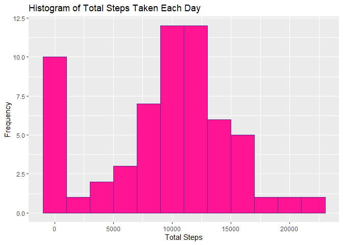
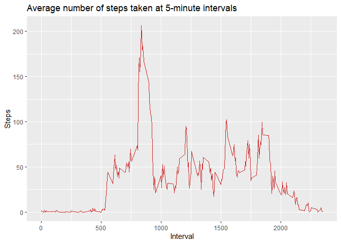
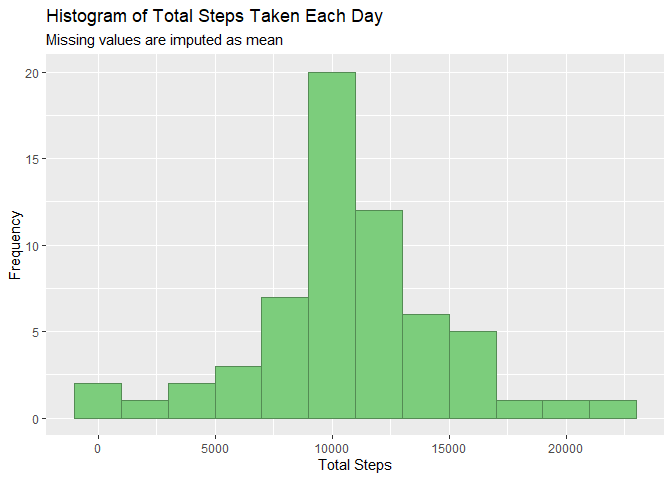
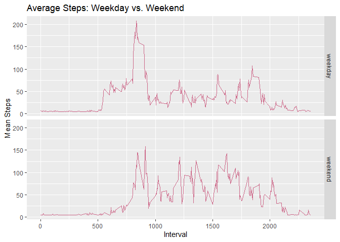

## Loading and preprocessing the data

```r
unzip("activity.zip")
d <- read.csv("activity.csv")

### First few rows
head(d)
```

```
##   steps       date interval
## 1    NA 2012-10-01        0
## 2    NA 2012-10-01        5
## 3    NA 2012-10-01       10
## 4    NA 2012-10-01       15
## 5    NA 2012-10-01       20
## 6    NA 2012-10-01       25
```

```r
### Structure of data
str(d)
```

```
## 'data.frame':	17568 obs. of  3 variables:
##  $ steps   : int  NA NA NA NA NA NA NA NA NA NA ...
##  $ date    : Factor w/ 61 levels "2012-10-01","2012-10-02",..: 1 1 1 1 1 1 1 1 1 1 ...
##  $ interval: int  0 5 10 15 20 25 30 35 40 45 ...
```

```r
### Dimension of data
dim(d)
```

```
## [1] 17568     3
```

```r
### Convert date into date format
library(lubridate)
```

```
## 
## Attaching package: 'lubridate'
```

```
## The following objects are masked from 'package:base':
## 
##     date, intersect, setdiff, union
```

```r
d$date <- ymd(d$date)
```

## What is mean total number of steps taken per day?
### Histogram of the total number of steps taken each day


```r
library(dplyr)
```

```
## 
## Attaching package: 'dplyr'
```

```
## The following objects are masked from 'package:lubridate':
## 
##     intersect, setdiff, union
```

```
## The following objects are masked from 'package:stats':
## 
##     filter, lag
```

```
## The following objects are masked from 'package:base':
## 
##     intersect, setdiff, setequal, union
```

```r
d2 <- data.frame(tapply(d$steps, d$date, sum, na.rm = TRUE))
d2$date <- rownames(d2)
rownames(d2) <- NULL
names(d2)[[1]] <- "Total_steps"
d2 <- select(d2, date, Total_steps)
library(ggplot2)
ggplot(d2, aes(Total_steps)) +
  geom_histogram(binwidth = 2000, col = "darkorchid4", fill = "deeppink") +
  labs(x = "Total Steps", y = "Frequency", 
       title = "Histogram of Total Steps Taken Each Day")
```

<!-- -->

### Mean and median of the total number of steps taken per day


```r
# Mean of total number of steps
mean(d2$Total_steps, na.rm = TRUE)
```

```
## [1] 9354.23
```

```r
# Median of total number of steps
median(d2$Total_steps, na.rm = TRUE)
```

```
## [1] 10395
```

## What is the average daily activity pattern?
### Make a time series plot of the 5-minute interval and the average number of steps taken, averaged across all days


```r
d3 <- aggregate(steps~interval,data=d,FUN=mean,na.action=na.omit)
ggplot(d3, aes(x = interval, y = steps)) +
  geom_line(col = "firebrick3") +
  labs(x = "Interval", y = "Steps",
       title = "Average number of steps taken at 5-minute intervals")
```

<!-- -->

### Which 5-minute interval, on average across all the days in the dataset, contains the maximum number of steps?


```r
tbl_df(d3) %>% select(interval, steps) %>% filter(steps == max(d3$steps))
```

```
## # A tibble: 1 x 2
##   interval steps
##      <int> <dbl>
## 1      835  206.
```

## Imputing missing values
### Total number of missing values


```r
nrow(d[is.na(d$steps),])
```

```
## [1] 2304
```

### Using mean to replace the missing values


```r
mean_steps <- round(mean(d$steps, na.rm = TRUE),3)
d$Complete.Steps <- ifelse(is.na(d$steps), mean_steps, d$steps)
```

### Create a new dataset that is equal to the original dataset but with the missing data filled in


```r
d4 <- d %>% select(date, interval, Complete.Steps)
head(d4)
```

```
##         date interval Complete.Steps
## 1 2012-10-01        0         37.383
## 2 2012-10-01        5         37.383
## 3 2012-10-01       10         37.383
## 4 2012-10-01       15         37.383
## 5 2012-10-01       20         37.383
## 6 2012-10-01       25         37.383
```

### Make a histogram of the total number of steps taken each day


```r
d4.agg <- aggregate(d4$Complete.Steps, list(d4$date), FUN=sum)
colnames(d4.agg) <- c("Date", "Total_steps")
ggplot(d4.agg, aes(Total_steps)) +
  geom_histogram(binwidth = 2000, col = "palegreen4", fill = "palegreen3") +
  labs(x = "Total Steps", y = "Frequency",
       title = "Histogram of Total Steps Taken Each Day",
       subtitle = "Missing values are imputed as mean")
```

<!-- -->

###  Mean and median total number of steps taken per day


```r
mean(d4.agg$Total_steps)
```

```
## [1] 10766.2
```

```r
median(d4.agg$Total_steps)
```

```
## [1] 10766.3
```

When the missing values are ignored in the original dataset, the mean and median of the total number of steps are 9354.23 and 10395, respectively. When the missing values are imputed as mean of the steps, the mean and median of the total number of steps are 10766.2 and 10766.3, respectively. This shows that there is a difference in mean and median when the missing values are imputed.

## Are there differences in activity patterns between weekdays and weekends?


```r
d4$Day <- weekdays(d4$date)
d4$Day.Type <- ifelse(d4$Day == 'Saturday' | d4$Day=='Sunday', 'weekend', 'weekday')
d4$Day.Type <- as.factor(d4$Day.Type)
str(d4)
```

```
## 'data.frame':	17568 obs. of  5 variables:
##  $ date          : Date, format: "2012-10-01" "2012-10-01" ...
##  $ interval      : int  0 5 10 15 20 25 30 35 40 45 ...
##  $ Complete.Steps: num  37.4 37.4 37.4 37.4 37.4 ...
##  $ Day           : chr  "Monday" "Monday" "Monday" "Monday" ...
##  $ Day.Type      : Factor w/ 2 levels "weekday","weekend": 1 1 1 1 1 1 1 1 1 1 ...
```

### Panel plot containing a time series plot of the 5-minute interval and the average number of steps taken, averaged across all weekday days or weekend day


```r
d5 <- aggregate(Complete.Steps~interval+Day.Type, d4, mean, na.action=na.omit)
ggplot(d5, aes(interval, Complete.Steps)) +
  geom_line(col = "palevioletred3") +
  labs(x = "Interval", y = "Mean Steps",
       title = "Average Steps: Weekday vs. Weekend") +
  facet_grid(Day.Type ~ .)
```

<!-- -->
